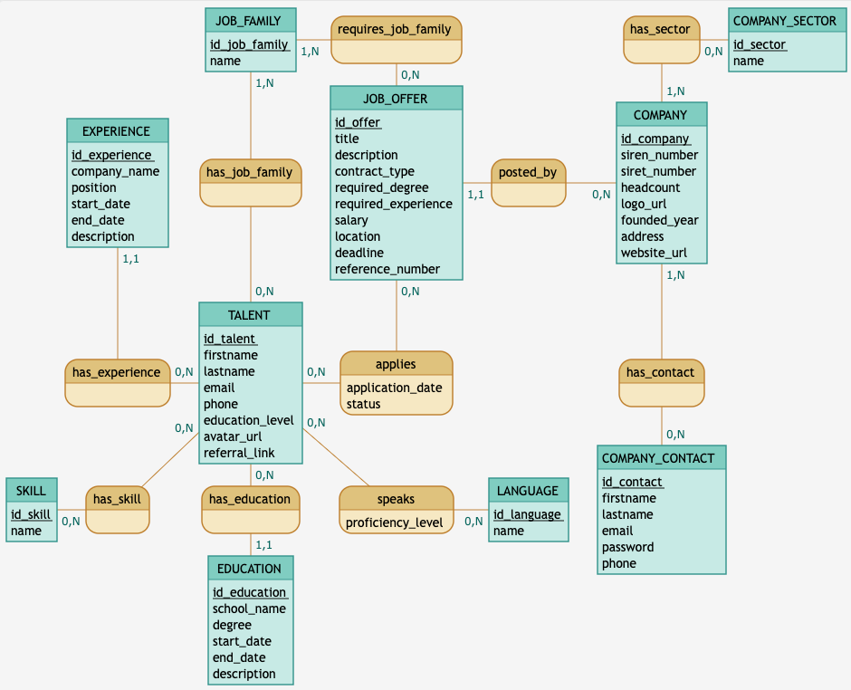

# Introduction

Nous allons documenter la base de données, les API, et les fonctionnalités principales de l'application WARP.

## MCD

Voilà l'architecture de la base de données :

---

## 📑 Sommaire

- [Introduction](#introduction)
  - [MCD](#mcd)
  - [📑 Sommaire](#-sommaire)
  - [📌 Description des tables](#-description-des-tables)
    - [**comingsoon**](#comingsoon)
    - [**company_sector**](#company_sector)
    - [**company**](#company)
    - [**company_contact**](#company_contact)
    - [**job_family**](#job_family)
    - [**job_offer**](#job_offer)
    - [**talent**](#talent)
    - [**application**](#application)
    - [**experience**](#experience)
    - [**education**](#education)
    - [**skill**](#skill)
    - [**talent_skill**](#talent_skill)
    - [**language**](#language)
    - [**talent_language**](#talent_language)

---

## 📌 Description des tables

### **comingsoon**

Table pour récupérer les emails des utilisateurs intéressés par la plateforme avant son lancement.

- `id` : identifiant unique (PK)
- `date` : date d’enregistrement (par défaut `CURRENT_TIMESTAMP`)
- `email` : adresse email de l’utilisateur (UNIQUE)

---

### **company_sector**

Référentiel des secteurs d’activité des entreprises.

- `id_sector` : identifiant unique (PK)
- `name` : nom du secteur (UNIQUE)  
  ➡ Relation : utilisé par la table **company**.

---

### **company**

Représente les entreprises clientes de la plateforme.

- `id_company` : identifiant unique (PK)
- `siren_number` : numéro SIREN (UNIQUE)
- `siret_number` : numéro SIRET (UNIQUE)
- `headcount` : effectif
- `logo_url` : logo de l’entreprise
- `founded_year` : année de création
- `address` : adresse complète
- `website_url` : site web officiel
- `id_sector` : FK → `company_sector`

➡ Relations :

- 1,N avec **company_contact**
- 1,N avec **job_offer**

---

### **company_contact**

Les utilisateurs rattachés à une entreprise (comptes employeurs).

- `id_contact` : identifiant unique (PK)
- `firstname`
- `lastname`
- `email` (UNIQUE)
- `password` (hashé)
- `phone`
- `id_company` : FK → `company`

➡ Relation : plusieurs contacts peuvent appartenir à une même entreprise.

---

### **job_family**

Référentiel des familles de métiers (utilisé pour talents et offres).

- `id_job_family` : identifiant unique (PK)
- `name` : nom de la famille (UNIQUE)

➡ Relations : lié à **talent** et **job_offer**.

---

### **job_offer**

Les offres d’emploi publiées par les entreprises.

- `id_offer` : identifiant unique (PK)
- `title` : titre du poste
- `description` : descriptif du poste
- `contract_type` : type de contrat (CDI, CDD, stage, etc.)
- `required_degree` : diplôme requis
- `required_experience` : expérience requise
- `salary` : salaire proposé
- `location` : lieu de travail
- `deadline` : date limite de candidature
- `reference_number` : identifiant unique de l’offre
- `id_company` : FK → `company`
- `id_job_family` : FK → `job_family`

➡ Relations :

- 1,N avec **application**
- N,1 avec **company**

---

### **talent**

Représente les candidats inscrits sur la plateforme.

- `id_talent` : identifiant unique (PK)
- `firstname`
- `lastname`
- `email` (UNIQUE)
- `phone`
- `education_level` : niveau d’étude global
- `avatar_url` : photo de profil
- `referral_link` : lien de parrainage
- `id_job_family` : FK → `job_family`

➡ Relations :

- 1,N avec **experience** et **education**
- N,N avec **skill** et **language**
- N,N avec **job_offer** via **application**

---

### **application**

Candidatures des talents aux offres d’emploi.

- `id_talent` : FK → `talent`
- `id_offer` : FK → `job_offer`
- `application_date` : date de candidature
- `status` : statut (ex. en cours, accepté, refusé)

➡ PK composite : `(id_talent, id_offer)`

---

### **experience**

Expériences professionnelles d’un talent.

- `id_experience` : identifiant unique (PK)
- `company_name` : entreprise (texte libre)
- `position` : poste occupé
- `start_date`
- `end_date`
- `description`
- `id_talent` : FK → `talent`

---

### **education**

Parcours scolaires et diplômes d’un talent.

- `id_education` : identifiant unique (PK)
- `school_name` : nom de l’établissement
- `degree` : diplôme obtenu
- `start_date`
- `end_date`
- `description`
- `id_talent` : FK → `talent`

---

### **skill**

Compétences référencées dans la plateforme.

- `id_skill` : identifiant unique (PK)
- `name` : nom de la compétence (UNIQUE)

➡ Relation : N,N avec **talent** via `talent_skill`.

---

### **talent_skill**

Table d’association entre talents et compétences.

- `id_talent` : FK → `talent`
- `id_skill` : FK → `skill`

➡ PK composite : `(id_talent, id_skill)`

---

### **language**

Référentiel des langues.

- `id_language` : identifiant unique (PK)
- `name` : nom de la langue (UNIQUE)

➡ Relation : N,N avec **talent** via `talent_language`.

---

### **talent_language**

Table d’association entre talents et langues.

- `id_talent` : FK → `talent`
- `id_language` : FK → `language`
- `proficiency_level` : niveau (A1, B2, C1, etc.)

➡ PK composite : `(id_talent, id_language)`
